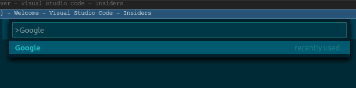
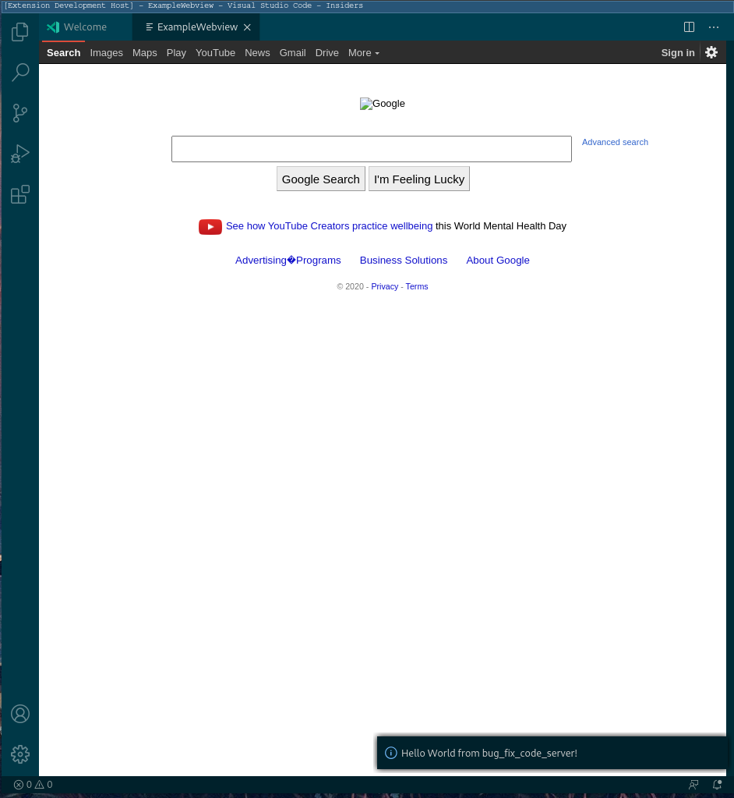

# bug-fix-code-server README

This is an example extension to attempt to reproduce a bug.

## Features

- Run the ```Google``` command in the vscode command palette



- this will make a get request and render the google homepage



## Known Issues

not yet sure if it works with code-server!